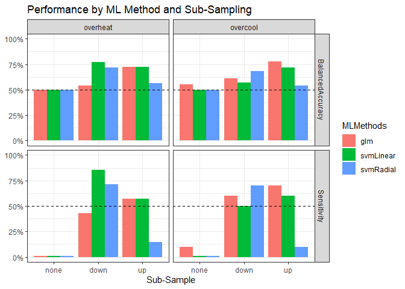

RECS Analysis
================
Arfa Aijazi
2/8/2021

# The Contribution of Building Characteristics on Heat and Cold-Related Morbidity: Evidence from Household Surveys in the United States

## Pre-Processing

### Load libraries

``` r
library(tidyverse)
library(knitr)
library(kableExtra)
library(caret)
library(randomForest)
library(doParallel)
library(ggsci)
library(Hmisc)
library(PerformanceAnalytics)
```

### Load 2015 RECS microdata from EIA

``` r
RECS_2015 <- read_csv("https://www.eia.gov/consumption/residential/data/2015/csv/recs2015_public_v4.csv")
```

### Explore data distribution of output classes

<!-- --> Medical
assistance needed because of thermal issues is a rare event (phew\!),
\<2% of all homes in the RECS 2015 microdata. More homes were too cold
than too hot and some homes had both types of thermal issues. In
classification ML problems, imbalance in observed classes can have a
negative impact on model fitting. Approaches to mitigate this issue are
to sub-sample the training data by *down-sampling*: subsets all classes
in the training set so that their class frequencies match the least
prevalent class or *up-sampling*: randomly sample (with replacement) the
minority class to be the same size as the majority class. I will test
the impact of both of these approaches on the predictive power of the ML
model [caret
documentation](https://topepo.github.io/caret/subsampling-for-class-imbalances.html).

Governments usually plan for heat and cold-related vulnerability
separately, so I will develop two separate sets of models to predict
whether a home is *too hot* or *too cold*, referred to as overheat and
overcool. The RECS 2015 encodes “too hot” issues in the variable HOTMA
and “too cold” issues in the variable COLDMA. In the overheat model
HOTMA is the dependent variable and in the overcool model COLDMA is the
dependent variable. Both dependent variables have two classes, they can
either be “yes” or “no”. The independent variables in both models are a
combination of climate, demographic, and building stock features. The
independent variables for both types of models is kept the same for
simplicity, but I will compare the relative importance of different
variables in predicting the different thermal issues.

### Filter and recode RECS 2015 data

``` r
thermalResilience <- RECS_2015 %>%
  select(CDD30YR, HDD30YR, DBT99, DBT1, NHSLDMEM, SDESCENT, HOUSEHOLDER_RACE, EDUCATION, EMPLOYHH, MONEYPY, HHAGE, UATYP10, KOWNRENT, ELPAY, NGPAY, LPGPAY, FOPAY, YEARMADERANGE, AIRCOND, WALLTYPE, ROOFTYPE, TYPEGLASS, WINFRAME, ADQINSUL, DRAFTY, TYPEHUQ, COOLTYPE, SWAMPCOL, HEATHOME, EQUIPM, NOHEATBROKE, NOHEATEL, NOHEATNG, NOHEATBULK, NOACBROKE, NOACEL, WINDOWS, NUMCFAN, NUMFLOORFAN, HOTMA, COLDMA) %>%
  mutate(UATYP10 = case_when(UATYP10 == "U" ~ 1,
                             UATYP10 == "C" ~ 0.5,
                             UATYP10 == "R" ~ 0))
glimpse(thermalResilience)
```

    ## Rows: 5,686
    ## Columns: 41
    ## $ CDD30YR          <dbl> 1332, 2494, 2059, 1327, 871, 396, 2546, 597, 820, ...
    ## $ HDD30YR          <dbl> 2640, 2178, 2714, 4205, 5397, 7224, 1795, 7191, 55...
    ## $ DBT99            <dbl> 33.0, 31.7, 24.9, 15.9, 15.5, 0.4, 34.6, -1.6, 15....
    ## $ DBT1             <dbl> 97.9, 96.8, 92.5, 91.3, 88.4, 84.5, 86.2, 86.6, 88...
    ## $ NHSLDMEM         <dbl> 4, 2, 4, 1, 3, 1, 1, 2, 4, 4, 1, 1, 1, 2, 5, 5, 2,...
    ## $ SDESCENT         <dbl> 0, 0, 0, 0, 0, 0, 0, 0, 0, 0, 0, 0, 0, 0, 0, 0, 0,...
    ## $ HOUSEHOLDER_RACE <dbl> 1, 1, 1, 3, 4, 1, 1, 1, 1, 1, 1, 1, 1, 1, 2, 1, 1,...
    ## $ EDUCATION        <dbl> 2, 2, 1, 4, 2, 1, 5, 2, 3, 4, 3, 3, 2, 4, 5, 4, 3,...
    ## $ EMPLOYHH         <dbl> 1, 2, 1, 0, 1, 0, 1, 0, 1, 1, 1, 1, 0, 1, 1, 0, 0,...
    ## $ MONEYPY          <dbl> 8, 2, 2, 3, 3, 1, 4, 3, 5, 6, 3, 1, 2, 2, 6, 7, 2,...
    ## $ HHAGE            <dbl> 42, 60, 73, 69, 51, 33, 53, 67, 56, 48, 64, 24, 83...
    ## $ UATYP10          <dbl> 1.0, 0.0, 1.0, 0.5, 1.0, 0.5, 1.0, 0.0, 1.0, 1.0, ...
    ## $ KOWNRENT         <dbl> 1, 1, 1, 1, 1, 2, 2, 1, 1, 2, 1, 2, 2, 2, 1, 2, 1,...
    ## $ ELPAY            <dbl> 1, 1, 1, 1, 1, 2, 1, 1, 1, 1, 1, 1, 1, 3, 1, 1, 1,...
    ## $ NGPAY            <dbl> 1, -2, 1, -2, 1, -2, 1, 1, -2, -2, -2, 1, 1, 2, 1,...
    ## $ LPGPAY           <dbl> -2, -2, -2, 1, -2, 2, -2, -2, -2, -2, -2, -2, -2, ...
    ## $ FOPAY            <dbl> -2, -2, -2, -2, -2, -2, -2, -2, 1, -2, 1, -2, -2, ...
    ## $ YEARMADERANGE    <dbl> 7, 5, 4, 2, 4, 5, 3, 4, 5, 2, 3, 1, 8, 4, 7, 8, 6,...
    ## $ AIRCOND          <dbl> 1, 1, 1, 1, 1, 1, 1, 1, 1, 1, 1, 0, 1, 1, 1, 1, 1,...
    ## $ WALLTYPE         <dbl> 4, 3, 2, 3, 1, 3, 1, 3, 3, 1, 3, 4, 1, 1, 1, 4, 3,...
    ## $ ROOFTYPE         <dbl> 1, 3, 5, 5, 5, -2, 5, 5, 5, 5, 5, 5, 5, -2, 7, -2,...
    ## $ TYPEGLASS        <dbl> 2, 1, 1, 2, 1, 2, 1, 2, 2, 1, 2, 1, 1, 2, 2, 2, 2,...
    ## $ WINFRAME         <dbl> 2, 2, 1, 2, 3, 1, 1, 1, 3, 1, 1, 1, 2, 1, 1, 2, 2,...
    ## $ ADQINSUL         <dbl> 2, 2, 2, 2, 2, 1, 3, 2, 2, 3, 2, 3, 3, 2, 1, 2, 1,...
    ## $ DRAFTY           <dbl> 4, 4, 3, 4, 4, 4, 4, 3, 3, 3, 3, 3, 3, 4, 4, 4, 3,...
    ## $ TYPEHUQ          <dbl> 2, 2, 2, 2, 2, 5, 4, 2, 2, 2, 2, 2, 2, 5, 2, 5, 1,...
    ## $ COOLTYPE         <dbl> 1, 2, 3, 1, 1, 2, 1, 2, 1, 1, 2, -2, 1, 2, 1, 1, 1...
    ## $ SWAMPCOL         <dbl> 0, 0, 0, -2, -2, -2, 0, -2, -2, 0, -2, -2, 0, -2, ...
    ## $ HEATHOME         <dbl> 1, 1, 1, 1, 1, 1, 1, 1, 1, 1, 1, 1, 1, 1, 1, 1, 1,...
    ## $ EQUIPM           <dbl> 3, 9, 3, 3, 3, 3, 3, 3, 3, 3, 3, 3, 3, 5, 3, 3, 3,...
    ## $ NOHEATBROKE      <dbl> 0, 0, 0, 0, 0, 0, 0, 0, 0, 0, 0, 1, 0, 0, 0, 0, 0,...
    ## $ NOHEATEL         <dbl> 0, 0, 0, 0, 0, 0, 0, 0, 0, 0, 0, 0, 0, 0, 0, 0, 0,...
    ## $ NOHEATNG         <dbl> 0, 0, 0, 0, 0, 0, 0, 0, 0, 0, 0, 0, 0, 0, 0, 0, 0,...
    ## $ NOHEATBULK       <dbl> 0, 0, 0, 0, 0, 0, 0, 0, 0, 0, 0, 0, 0, 0, 0, 0, 0,...
    ## $ NOACBROKE        <dbl> 0, 1, 0, 0, 0, 0, 0, 0, 0, 0, 0, 0, 0, 0, 0, 0, 0,...
    ## $ NOACEL           <dbl> 0, 0, 0, 0, 0, 0, 0, 0, 0, 0, 0, 0, 0, 0, 0, 0, 0,...
    ## $ WINDOWS          <dbl> 41, 20, 41, 42, 30, 20, 30, 30, 41, 42, 41, 30, 41...
    ## $ NUMCFAN          <dbl> 5, 3, 7, 9, 2, 0, 2, 3, 2, 4, 1, 2, 5, 0, 2, 4, 4,...
    ## $ NUMFLOORFAN      <dbl> 0, 1, 0, 0, 2, 2, 0, 3, 0, 0, 2, 1, 0, 1, 2, 0, 0,...
    ## $ HOTMA            <dbl> 0, 0, 0, 0, 0, 0, 0, 0, 0, 0, 0, 0, 0, 0, 0, 0, 0,...
    ## $ COLDMA           <dbl> 0, 0, 0, 0, 0, 0, 0, 0, 0, 0, 0, 0, 0, 0, 0, 0, 0,...

Recode variables

``` r
thermalResilience_recode <- thermalResilience %>%
  mutate(HOUSEHOLDER_RACE = case_when(HOUSEHOLDER_RACE == 1 ~ "White",
                                      HOUSEHOLDER_RACE == 2 ~ "Black", 
                                      HOUSEHOLDER_RACE == 3 ~ "AmericanIndianAlaskanNative",
                                      HOUSEHOLDER_RACE == 4 ~ "Asian",
                                      HOUSEHOLDER_RACE == 5 ~ "NativeHawaiianPacificIslander",
                                      HOUSEHOLDER_RACE == 6 ~ "OtherRace",
                                      HOUSEHOLDER_RACE == 7 ~ "MixedRace")) %>%
  mutate(MONEYPY = case_when(MONEYPY == 1 ~ 0,
                             MONEYPY == 2 ~ 20000,
                             MONEYPY == 3 ~ 40000,
                             MONEYPY == 4 ~ 60000,
                             MONEYPY == 5 ~ 80000,
                             MONEYPY == 6 ~ 100000,
                             MONEYPY == 7 ~ 120000,
                             MONEYPY == 8 ~ 140000)) %>%
  mutate(YEARMADERANGE = case_when(YEARMADERANGE == 1 ~ 1950,
                                   YEARMADERANGE == 2 ~ 1959,
                                   YEARMADERANGE == 3 ~ 1969,
                                   YEARMADERANGE == 4 ~ 1979,
                                   YEARMADERANGE == 5 ~ 1989,
                                   YEARMADERANGE == 6 ~ 1999,
                                   YEARMADERANGE == 7 ~ 2009,
                                   YEARMADERANGE == 8 ~ 2015)) %>%
  mutate(WALLTYPE = case_when(WALLTYPE == 1 ~ "Brick",
                              WALLTYPE == 2 ~ "Wood",
                              WALLTYPE == 3 ~ "Siding",
                              WALLTYPE == 4 ~ "Stucco",
                              WALLTYPE == 5 ~ "Shingle",
                              WALLTYPE == 6 ~ "Stone",
                              WALLTYPE == 7 ~ "Concrete",
                              WALLTYPE == 8 ~ "Other")) %>%
  mutate(ROOFTYPE =  case_when(ROOFTYPE == 1 ~ "CeramicClayTile",
                               ROOFTYPE == 2 ~ "WoodShingleShakes", 
                               ROOFTYPE == 3 ~ "Metal",
                               ROOFTYPE == 4 ~ "SlateSyntheticShake",
                               ROOFTYPE == 5 ~ "ConcreteTiles",
                               ROOFTYPE == 9 ~ "Other",
                               ROOFTYPE == -2 ~ "NA")) %>%
  mutate(WINFRAME = case_when(WINFRAME == 1 ~ "Wood",
                              WINFRAME == 2 ~ "Metal",
                              WINFRAME == 3 ~ "Vinyl",
                              WINFRAME == 4 ~ "Composite",
                              WINFRAME == 5 ~ "Fiberglass")) %>%
  mutate(TYPEHUQ = case_when(TYPEHUQ == 1 ~ "Mobile",
                             TYPEHUQ == 2 ~ "SingleFamDetached",
                             TYPEHUQ == 3 ~ "SingleFamAttached",
                             TYPEHUQ == 4 ~ "LowRiseApt",
                             TYPEHUQ == 5 ~ "HighRiseApt")) %>%
  mutate(COOLTYPE = case_when(COOLTYPE == 1 ~ "CentralAir",
                              COOLTYPE == 2 ~ "IndvdWinUnit",
                              COOLTYPE == 3 ~ "Both",
                              COOLTYPE == -2 ~ "None")) %>%
  mutate(EQUIPM = case_when(EQUIPM == 2 ~ "SteamHotWater",
                             EQUIPM == 3 ~ "CentralFurnace", 
                             EQUIPM == 4 ~ "HeatPump", 
                             EQUIPM == 5 ~ "BuiltInElectric",
                             EQUIPM == 6 ~ "BuiltInFurnace",
                             EQUIPM == 7 ~ "BuiltInGas",
                             EQUIPM == 8 ~ "WoodStove",
                             EQUIPM == 9 ~ "Fireplace",
                             EQUIPM == 10 ~ "PortableElectric",
                             EQUIPM == 21 ~ "Other",
                             EQUIPM == -2 ~ "None")) %>%
  mutate(EMPLOYHH = case_when(EMPLOYHH == 1 ~ 1, 
                              EMPLOYHH == 2 ~ 0.5,
                              EMPLOYHH == 0 ~ 0)) %>%
  mutate(KOWNRENT = case_when(KOWNRENT == 1 ~ "Owned",
                              KOWNRENT == 2 ~ "Rented",
                              KOWNRENT == 3 ~ "Occupied")) %>%
  mutate(ELPAY = case_when(ELPAY == 1 ~ "HouseholdPays",
                           ELPAY == 2 ~ "FullyIncluded",
                           ELPAY == 3 ~ "PartiallyIncluded",
                           ELPAY == 9 ~ "Other")) %>%
  mutate(NGPAY = case_when(NGPAY == 1 ~ "HouseholdPays",
                           NGPAY == 2 ~ "FullyIncluded",
                           NGPAY == 3 ~ "PartiallyIncluded",
                           NGPAY == 9 ~ "Other",
                           NGPAY == -2 ~ "NA")) %>%
  mutate(LPGPAY = case_when(LPGPAY == 1 ~ "HouseholdPays",
                           LPGPAY == 2 ~ "FullyIncluded",
                           LPGPAY == 3 ~ "PartiallyIncluded",
                           LPGPAY == 9 ~ "Other",
                           LPGPAY == -2 ~ "NA")) %>%
  mutate(FOPAY = case_when(FOPAY == 1 ~ "HouseholdPays",
                           FOPAY == 2 ~ "FullyIncluded",
                           FOPAY == 3 ~ "PartiallyIncluded",
                           FOPAY == 9 ~ "Other",
                           FOPAY == -2 ~ "NA")) %>%
  mutate(WINDOWS = case_when(WINDOWS == 10 ~ 1,
                             WINDOWS == 20 ~ 3,
                             WINDOWS == 30 ~ 6,
                             WINDOWS == 41 ~ 10,
                             WINDOWS == 42 ~ 16,
                             WINDOWS == 50 ~ 20,
                             WINDOWS == 60 ~ 30)) %>%
  mutate(UATYP10 = case_when(UATYP10 == 1 ~ "U",
                             UATYP10 == 0.5 ~ "C",
                             UATYP10 == 0 ~ "R"))
glimpse(thermalResilience_recode)
```

    ## Rows: 5,686
    ## Columns: 41
    ## $ CDD30YR          <dbl> 1332, 2494, 2059, 1327, 871, 396, 2546, 597, 820, ...
    ## $ HDD30YR          <dbl> 2640, 2178, 2714, 4205, 5397, 7224, 1795, 7191, 55...
    ## $ DBT99            <dbl> 33.0, 31.7, 24.9, 15.9, 15.5, 0.4, 34.6, -1.6, 15....
    ## $ DBT1             <dbl> 97.9, 96.8, 92.5, 91.3, 88.4, 84.5, 86.2, 86.6, 88...
    ## $ NHSLDMEM         <dbl> 4, 2, 4, 1, 3, 1, 1, 2, 4, 4, 1, 1, 1, 2, 5, 5, 2,...
    ## $ SDESCENT         <dbl> 0, 0, 0, 0, 0, 0, 0, 0, 0, 0, 0, 0, 0, 0, 0, 0, 0,...
    ## $ HOUSEHOLDER_RACE <chr> "White", "White", "White", "AmericanIndianAlaskanN...
    ## $ EDUCATION        <dbl> 2, 2, 1, 4, 2, 1, 5, 2, 3, 4, 3, 3, 2, 4, 5, 4, 3,...
    ## $ EMPLOYHH         <dbl> 1.0, 0.5, 1.0, 0.0, 1.0, 0.0, 1.0, 0.0, 1.0, 1.0, ...
    ## $ MONEYPY          <dbl> 140000, 20000, 20000, 40000, 40000, 0, 60000, 4000...
    ## $ HHAGE            <dbl> 42, 60, 73, 69, 51, 33, 53, 67, 56, 48, 64, 24, 83...
    ## $ UATYP10          <chr> "U", "R", "U", "C", "U", "C", "U", "R", "U", "U", ...
    ## $ KOWNRENT         <chr> "Owned", "Owned", "Owned", "Owned", "Owned", "Rent...
    ## $ ELPAY            <chr> "HouseholdPays", "HouseholdPays", "HouseholdPays",...
    ## $ NGPAY            <chr> "HouseholdPays", "NA", "HouseholdPays", "NA", "Hou...
    ## $ LPGPAY           <chr> "NA", "NA", "NA", "HouseholdPays", "NA", "FullyInc...
    ## $ FOPAY            <chr> "NA", "NA", "NA", "NA", "NA", "NA", "NA", "NA", "H...
    ## $ YEARMADERANGE    <dbl> 2009, 1989, 1979, 1959, 1979, 1989, 1969, 1979, 19...
    ## $ AIRCOND          <dbl> 1, 1, 1, 1, 1, 1, 1, 1, 1, 1, 1, 0, 1, 1, 1, 1, 1,...
    ## $ WALLTYPE         <chr> "Stucco", "Siding", "Wood", "Siding", "Brick", "Si...
    ## $ ROOFTYPE         <chr> "CeramicClayTile", "Metal", "ConcreteTiles", "Conc...
    ## $ TYPEGLASS        <dbl> 2, 1, 1, 2, 1, 2, 1, 2, 2, 1, 2, 1, 1, 2, 2, 2, 2,...
    ## $ WINFRAME         <chr> "Metal", "Metal", "Wood", "Metal", "Vinyl", "Wood"...
    ## $ ADQINSUL         <dbl> 2, 2, 2, 2, 2, 1, 3, 2, 2, 3, 2, 3, 3, 2, 1, 2, 1,...
    ## $ DRAFTY           <dbl> 4, 4, 3, 4, 4, 4, 4, 3, 3, 3, 3, 3, 3, 4, 4, 4, 3,...
    ## $ TYPEHUQ          <chr> "SingleFamDetached", "SingleFamDetached", "SingleF...
    ## $ COOLTYPE         <chr> "CentralAir", "IndvdWinUnit", "Both", "CentralAir"...
    ## $ SWAMPCOL         <dbl> 0, 0, 0, -2, -2, -2, 0, -2, -2, 0, -2, -2, 0, -2, ...
    ## $ HEATHOME         <dbl> 1, 1, 1, 1, 1, 1, 1, 1, 1, 1, 1, 1, 1, 1, 1, 1, 1,...
    ## $ EQUIPM           <chr> "CentralFurnace", "Fireplace", "CentralFurnace", "...
    ## $ NOHEATBROKE      <dbl> 0, 0, 0, 0, 0, 0, 0, 0, 0, 0, 0, 1, 0, 0, 0, 0, 0,...
    ## $ NOHEATEL         <dbl> 0, 0, 0, 0, 0, 0, 0, 0, 0, 0, 0, 0, 0, 0, 0, 0, 0,...
    ## $ NOHEATNG         <dbl> 0, 0, 0, 0, 0, 0, 0, 0, 0, 0, 0, 0, 0, 0, 0, 0, 0,...
    ## $ NOHEATBULK       <dbl> 0, 0, 0, 0, 0, 0, 0, 0, 0, 0, 0, 0, 0, 0, 0, 0, 0,...
    ## $ NOACBROKE        <dbl> 0, 1, 0, 0, 0, 0, 0, 0, 0, 0, 0, 0, 0, 0, 0, 0, 0,...
    ## $ NOACEL           <dbl> 0, 0, 0, 0, 0, 0, 0, 0, 0, 0, 0, 0, 0, 0, 0, 0, 0,...
    ## $ WINDOWS          <dbl> 10, 3, 10, 16, 6, 3, 6, 6, 10, 16, 10, 6, 10, 6, 1...
    ## $ NUMCFAN          <dbl> 5, 3, 7, 9, 2, 0, 2, 3, 2, 4, 1, 2, 5, 0, 2, 4, 4,...
    ## $ NUMFLOORFAN      <dbl> 0, 1, 0, 0, 2, 2, 0, 3, 0, 0, 2, 1, 0, 1, 2, 0, 0,...
    ## $ HOTMA            <dbl> 0, 0, 0, 0, 0, 0, 0, 0, 0, 0, 0, 0, 0, 0, 0, 0, 0,...
    ## $ COLDMA           <dbl> 0, 0, 0, 0, 0, 0, 0, 0, 0, 0, 0, 0, 0, 0, 0, 0, 0,...

Create dummy variables

``` r
dummies <- dummyVars(~ ., data = thermalResilience_recode)
thermalResilience_dummy <- data.frame(predict(dummies, newdata = thermalResilience_recode)) %>%
  drop_na()
glimpse(thermalResilience_dummy)
```

    ## Rows: 5,549
    ## Columns: 98
    ## $ CDD30YR                                       <dbl> 1332, 2494, 2059, 132...
    ## $ HDD30YR                                       <dbl> 2640, 2178, 2714, 420...
    ## $ DBT99                                         <dbl> 33.0, 31.7, 24.9, 15....
    ## $ DBT1                                          <dbl> 97.9, 96.8, 92.5, 91....
    ## $ NHSLDMEM                                      <dbl> 4, 2, 4, 1, 3, 1, 1, ...
    ## $ SDESCENT                                      <dbl> 0, 0, 0, 0, 0, 0, 0, ...
    ## $ HOUSEHOLDER_RACEAmericanIndianAlaskanNative   <dbl> 0, 0, 0, 1, 0, 0, 0, ...
    ## $ HOUSEHOLDER_RACEAsian                         <dbl> 0, 0, 0, 0, 1, 0, 0, ...
    ## $ HOUSEHOLDER_RACEBlack                         <dbl> 0, 0, 0, 0, 0, 0, 0, ...
    ## $ HOUSEHOLDER_RACEMixedRace                     <dbl> 0, 0, 0, 0, 0, 0, 0, ...
    ## $ HOUSEHOLDER_RACENativeHawaiianPacificIslander <dbl> 0, 0, 0, 0, 0, 0, 0, ...
    ## $ HOUSEHOLDER_RACEWhite                         <dbl> 1, 1, 1, 0, 0, 1, 1, ...
    ## $ EDUCATION                                     <dbl> 2, 2, 1, 4, 2, 1, 5, ...
    ## $ EMPLOYHH                                      <dbl> 1.0, 0.5, 1.0, 0.0, 1...
    ## $ MONEYPY                                       <dbl> 140000, 20000, 20000,...
    ## $ HHAGE                                         <dbl> 42, 60, 73, 69, 51, 3...
    ## $ UATYP10C                                      <dbl> 0, 0, 0, 1, 0, 1, 0, ...
    ## $ UATYP10R                                      <dbl> 0, 1, 0, 0, 0, 0, 0, ...
    ## $ UATYP10U                                      <dbl> 1, 0, 1, 0, 1, 0, 1, ...
    ## $ KOWNRENTOccupied                              <dbl> 0, 0, 0, 0, 0, 0, 0, ...
    ## $ KOWNRENTOwned                                 <dbl> 1, 1, 1, 1, 1, 0, 0, ...
    ## $ KOWNRENTRented                                <dbl> 0, 0, 0, 0, 0, 1, 1, ...
    ## $ ELPAYFullyIncluded                            <dbl> 0, 0, 0, 0, 0, 1, 0, ...
    ## $ ELPAYHouseholdPays                            <dbl> 1, 1, 1, 1, 1, 0, 1, ...
    ## $ ELPAYOther                                    <dbl> 0, 0, 0, 0, 0, 0, 0, ...
    ## $ ELPAYPartiallyIncluded                        <dbl> 0, 0, 0, 0, 0, 0, 0, ...
    ## $ NGPAYFullyIncluded                            <dbl> 0, 0, 0, 0, 0, 0, 0, ...
    ## $ NGPAYHouseholdPays                            <dbl> 1, 0, 1, 0, 1, 0, 1, ...
    ## $ NGPAYNA                                       <dbl> 0, 1, 0, 1, 0, 1, 0, ...
    ## $ NGPAYOther                                    <dbl> 0, 0, 0, 0, 0, 0, 0, ...
    ## $ NGPAYPartiallyIncluded                        <dbl> 0, 0, 0, 0, 0, 0, 0, ...
    ## $ LPGPAYFullyIncluded                           <dbl> 0, 0, 0, 0, 0, 1, 0, ...
    ## $ LPGPAYHouseholdPays                           <dbl> 0, 0, 0, 1, 0, 0, 0, ...
    ## $ LPGPAYNA                                      <dbl> 1, 1, 1, 0, 1, 0, 1, ...
    ## $ LPGPAYOther                                   <dbl> 0, 0, 0, 0, 0, 0, 0, ...
    ## $ LPGPAYPartiallyIncluded                       <dbl> 0, 0, 0, 0, 0, 0, 0, ...
    ## $ FOPAYFullyIncluded                            <dbl> 0, 0, 0, 0, 0, 0, 0, ...
    ## $ FOPAYHouseholdPays                            <dbl> 0, 0, 0, 0, 0, 0, 0, ...
    ## $ FOPAYNA                                       <dbl> 1, 1, 1, 1, 1, 1, 1, ...
    ## $ FOPAYOther                                    <dbl> 0, 0, 0, 0, 0, 0, 0, ...
    ## $ FOPAYPartiallyIncluded                        <dbl> 0, 0, 0, 0, 0, 0, 0, ...
    ## $ YEARMADERANGE                                 <dbl> 2009, 1989, 1979, 195...
    ## $ AIRCOND                                       <dbl> 1, 1, 1, 1, 1, 1, 1, ...
    ## $ WALLTYPEBrick                                 <dbl> 0, 0, 0, 0, 1, 0, 1, ...
    ## $ WALLTYPEConcrete                              <dbl> 0, 0, 0, 0, 0, 0, 0, ...
    ## $ WALLTYPEShingle                               <dbl> 0, 0, 0, 0, 0, 0, 0, ...
    ## $ WALLTYPESiding                                <dbl> 0, 1, 0, 1, 0, 1, 0, ...
    ## $ WALLTYPEStone                                 <dbl> 0, 0, 0, 0, 0, 0, 0, ...
    ## $ WALLTYPEStucco                                <dbl> 1, 0, 0, 0, 0, 0, 0, ...
    ## $ WALLTYPEWood                                  <dbl> 0, 0, 1, 0, 0, 0, 0, ...
    ## $ ROOFTYPECeramicClayTile                       <dbl> 1, 0, 0, 0, 0, 0, 0, ...
    ## $ ROOFTYPEConcreteTiles                         <dbl> 0, 0, 1, 1, 1, 0, 1, ...
    ## $ ROOFTYPEMetal                                 <dbl> 0, 1, 0, 0, 0, 0, 0, ...
    ## $ ROOFTYPENA                                    <dbl> 0, 0, 0, 0, 0, 1, 0, ...
    ## $ ROOFTYPEOther                                 <dbl> 0, 0, 0, 0, 0, 0, 0, ...
    ## $ ROOFTYPESlateSyntheticShake                   <dbl> 0, 0, 0, 0, 0, 0, 0, ...
    ## $ ROOFTYPEWoodShingleShakes                     <dbl> 0, 0, 0, 0, 0, 0, 0, ...
    ## $ TYPEGLASS                                     <dbl> 2, 1, 1, 2, 1, 2, 1, ...
    ## $ WINFRAMEComposite                             <dbl> 0, 0, 0, 0, 0, 0, 0, ...
    ## $ WINFRAMEFiberglass                            <dbl> 0, 0, 0, 0, 0, 0, 0, ...
    ## $ WINFRAMEMetal                                 <dbl> 1, 1, 0, 1, 0, 0, 0, ...
    ## $ WINFRAMEVinyl                                 <dbl> 0, 0, 0, 0, 1, 0, 0, ...
    ## $ WINFRAMEWood                                  <dbl> 0, 0, 1, 0, 0, 1, 1, ...
    ## $ ADQINSUL                                      <dbl> 2, 2, 2, 2, 2, 1, 3, ...
    ## $ DRAFTY                                        <dbl> 4, 4, 3, 4, 4, 4, 4, ...
    ## $ TYPEHUQHighRiseApt                            <dbl> 0, 0, 0, 0, 0, 1, 0, ...
    ## $ TYPEHUQLowRiseApt                             <dbl> 0, 0, 0, 0, 0, 0, 1, ...
    ## $ TYPEHUQMobile                                 <dbl> 0, 0, 0, 0, 0, 0, 0, ...
    ## $ TYPEHUQSingleFamAttached                      <dbl> 0, 0, 0, 0, 0, 0, 0, ...
    ## $ TYPEHUQSingleFamDetached                      <dbl> 1, 1, 1, 1, 1, 0, 0, ...
    ## $ COOLTYPEBoth                                  <dbl> 0, 0, 1, 0, 0, 0, 0, ...
    ## $ COOLTYPECentralAir                            <dbl> 1, 0, 0, 1, 1, 0, 1, ...
    ## $ COOLTYPEIndvdWinUnit                          <dbl> 0, 1, 0, 0, 0, 1, 0, ...
    ## $ COOLTYPENone                                  <dbl> 0, 0, 0, 0, 0, 0, 0, ...
    ## $ SWAMPCOL                                      <dbl> 0, 0, 0, -2, -2, -2, ...
    ## $ HEATHOME                                      <dbl> 1, 1, 1, 1, 1, 1, 1, ...
    ## $ EQUIPMBuiltInElectric                         <dbl> 0, 0, 0, 0, 0, 0, 0, ...
    ## $ EQUIPMBuiltInFurnace                          <dbl> 0, 0, 0, 0, 0, 0, 0, ...
    ## $ EQUIPMBuiltInGas                              <dbl> 0, 0, 0, 0, 0, 0, 0, ...
    ## $ EQUIPMCentralFurnace                          <dbl> 1, 0, 1, 1, 1, 1, 1, ...
    ## $ EQUIPMFireplace                               <dbl> 0, 1, 0, 0, 0, 0, 0, ...
    ## $ EQUIPMHeatPump                                <dbl> 0, 0, 0, 0, 0, 0, 0, ...
    ## $ EQUIPMNone                                    <dbl> 0, 0, 0, 0, 0, 0, 0, ...
    ## $ EQUIPMOther                                   <dbl> 0, 0, 0, 0, 0, 0, 0, ...
    ## $ EQUIPMPortableElectric                        <dbl> 0, 0, 0, 0, 0, 0, 0, ...
    ## $ EQUIPMSteamHotWater                           <dbl> 0, 0, 0, 0, 0, 0, 0, ...
    ## $ EQUIPMWoodStove                               <dbl> 0, 0, 0, 0, 0, 0, 0, ...
    ## $ NOHEATBROKE                                   <dbl> 0, 0, 0, 0, 0, 0, 0, ...
    ## $ NOHEATEL                                      <dbl> 0, 0, 0, 0, 0, 0, 0, ...
    ## $ NOHEATNG                                      <dbl> 0, 0, 0, 0, 0, 0, 0, ...
    ## $ NOHEATBULK                                    <dbl> 0, 0, 0, 0, 0, 0, 0, ...
    ## $ NOACBROKE                                     <dbl> 0, 1, 0, 0, 0, 0, 0, ...
    ## $ NOACEL                                        <dbl> 0, 0, 0, 0, 0, 0, 0, ...
    ## $ WINDOWS                                       <dbl> 10, 3, 10, 16, 6, 3, ...
    ## $ NUMCFAN                                       <dbl> 5, 3, 7, 9, 2, 0, 2, ...
    ## $ NUMFLOORFAN                                   <dbl> 0, 1, 0, 0, 2, 2, 0, ...
    ## $ HOTMA                                         <dbl> 0, 0, 0, 0, 0, 0, 0, ...
    ## $ COLDMA                                        <dbl> 0, 0, 0, 0, 0, 0, 0, ...

### Identifying Zero and Near Zero-Variance Predictors

Constant or almost constant predictors across samples, called zero or
near zero-variance predictors, can cause some machine learning model
types to crash or produce unstable results. The concern is that near
zero-variance predictors may become zero-variance predictors when the
data is split into sub-samples for training, testing, and
cross-validation. This step flags zero or near-zero variance predictors,
by computing two metrics for the subsetted RECS 2015 data. The frequency
ratio (freqRatio) is the frequency of the most prevalent value to the
second most frequent value. This value will be near 1 for well-behaved
predictors and very large for highly-unbalanced data. The percent of
unique values (percentUnique) is the number of unique values divided by
the total number of samples (times 100). This value approaches zero for
highly granular data. The default threshold for near zero-variance is a
frequency ratio greater than 19 or a percentage of unique values less
than 10.

``` 
                                    Variable  freqRatio percentUnique
```

1 FOPAYPartiallyIncluded 5548.00000 0.03604253 2 LPGPAYPartiallyIncluded
2773.50000 0.03604253 3 FOPAYOther 2773.50000 0.03604253 4 LPGPAYOther
923.83333 0.03604253 5 LPGPAYFullyIncluded 425.84615 0.03604253 6
NGPAYOther 345.81250 0.03604253 7
HOUSEHOLDER\_RACENativeHawaiianPacificIslander 251.22727 0.03604253 8
NGPAYPartiallyIncluded 204.51852 0.03604253 9 NOHEATNG 204.51852
0.03604253 10 FOPAYFullyIncluded 197.17857 0.03604253 11 EQUIPMOther
183.96667 0.03604253 12 ELPAYOther 157.54286 0.03604253 13 NOHEATBULK
148.97297 0.03604253 14 EQUIPMFireplace 145.02632 0.03604253 15 HOTMA
145.02632 0.03604253 16 ELPAYPartiallyIncluded 109.98000 0.03604253 17
EQUIPMBuiltInFurnace 103.69811 0.03604253 18 COLDMA 103.69811 0.03604253
19 ROOFTYPESlateSyntheticShake 93.05085 0.03604253 20 NOACEL 93.05085
0.03604253 21 KOWNRENTOccupied 89.96721 0.03604253 22 WALLTYPEStone
89.96721 0.03604253 23 HOUSEHOLDER\_RACEAmericanIndianAlaskanNative
85.70312 0.03604253 24 ROOFTYPEOther 80.60294 0.03604253 25
WINFRAMEComposite 75.01370 0.03604253 26 NOHEATEL 75.01370 0.03604253 27
WINFRAMEFiberglass 58.66667 0.03604253 28 HOUSEHOLDER\_RACEMixedRace
45.24167 0.03604253 29 EQUIPMPortableElectric 41.03788 0.03604253 30
WALLTYPEShingle 39.80147 0.03604253 31 EQUIPMWoodStove 39.50365
0.03604253 32 EQUIPMBuiltInGas 37.26897 0.03604253 33 NOHEATBROKE
35.74834 0.03604253 34 HOUSEHOLDER\_RACEAsian 23.12609 0.03604253 35
ROOFTYPECeramicClayTile 22.71368 0.03604253 36 ELPAYFullyIncluded
22.12083 0.03604253 37 HEATHOME 21.64898 0.03604253 38 EQUIPMNone
21.64898 0.03604253 39 COOLTYPEBoth 21.46559 0.03604253 40 NOACBROKE
20.59144 0.03604253 41 ROOFTYPEWoodShingleShakes 20.50775 0.03604253 42
FOPAYHouseholdPays 20.34231 0.03604253 43 NGPAYFullyIncluded 20.26054
0.03604253 zeroVar nzv 1 FALSE TRUE 2 FALSE TRUE 3 FALSE TRUE 4 FALSE
TRUE 5 FALSE TRUE 6 FALSE TRUE 7 FALSE TRUE 8 FALSE TRUE 9 FALSE TRUE 10
FALSE TRUE 11 FALSE TRUE 12 FALSE TRUE 13 FALSE TRUE 14 FALSE TRUE 15
FALSE TRUE 16 FALSE TRUE 17 FALSE TRUE 18 FALSE TRUE 19 FALSE TRUE 20
FALSE TRUE 21 FALSE TRUE 22 FALSE TRUE 23 FALSE TRUE 24 FALSE TRUE 25
FALSE TRUE 26 FALSE TRUE 27 FALSE TRUE 28 FALSE TRUE 29 FALSE TRUE 30
FALSE TRUE 31 FALSE TRUE 32 FALSE TRUE 33 FALSE TRUE 34 FALSE TRUE 35
FALSE TRUE 36 FALSE TRUE 37 FALSE TRUE 38 FALSE TRUE 39 FALSE TRUE 40
FALSE TRUE 41 FALSE TRUE 42 FALSE TRUE 43 FALSE TRUE The table shows
that 43 columns, including the two target variables have near zero
variance with a threshold frequency ratio of 19 (95/5). I will remove
predictor variables with a more conservative frequency ratio of 49
(98/2) in order to reduce the amount of data dropped while preserving
stability of the ML Models

``` r
nzv <- nearZeroVar(thermalResilience_dummy, freqCut = 49)
nzv <- head(nzv, -2)
thermalResilience_dummy_nzv <- thermalResilience_dummy[,-nzv]
glimpse(thermalResilience_dummy_nzv)
```

    ## Rows: 5,549
    ## Columns: 73
    ## $ CDD30YR                   <dbl> 1332, 2494, 2059, 1327, 871, 396, 2546, 5...
    ## $ HDD30YR                   <dbl> 2640, 2178, 2714, 4205, 5397, 7224, 1795,...
    ## $ DBT99                     <dbl> 33.0, 31.7, 24.9, 15.9, 15.5, 0.4, 34.6, ...
    ## $ DBT1                      <dbl> 97.9, 96.8, 92.5, 91.3, 88.4, 84.5, 86.2,...
    ## $ NHSLDMEM                  <dbl> 4, 2, 4, 1, 3, 1, 1, 2, 4, 4, 1, 1, 1, 2,...
    ## $ SDESCENT                  <dbl> 0, 0, 0, 0, 0, 0, 0, 0, 0, 0, 0, 0, 0, 0,...
    ## $ HOUSEHOLDER_RACEAsian     <dbl> 0, 0, 0, 0, 1, 0, 0, 0, 0, 0, 0, 0, 0, 0,...
    ## $ HOUSEHOLDER_RACEBlack     <dbl> 0, 0, 0, 0, 0, 0, 0, 0, 0, 0, 0, 0, 0, 0,...
    ## $ HOUSEHOLDER_RACEMixedRace <dbl> 0, 0, 0, 0, 0, 0, 0, 0, 0, 0, 0, 0, 0, 0,...
    ## $ HOUSEHOLDER_RACEWhite     <dbl> 1, 1, 1, 0, 0, 1, 1, 1, 1, 1, 1, 1, 1, 1,...
    ## $ EDUCATION                 <dbl> 2, 2, 1, 4, 2, 1, 5, 2, 3, 4, 3, 3, 2, 4,...
    ## $ EMPLOYHH                  <dbl> 1.0, 0.5, 1.0, 0.0, 1.0, 0.0, 1.0, 0.0, 1...
    ## $ MONEYPY                   <dbl> 140000, 20000, 20000, 40000, 40000, 0, 60...
    ## $ HHAGE                     <dbl> 42, 60, 73, 69, 51, 33, 53, 67, 56, 48, 6...
    ## $ UATYP10C                  <dbl> 0, 0, 0, 1, 0, 1, 0, 0, 0, 0, 0, 0, 1, 0,...
    ## $ UATYP10R                  <dbl> 0, 1, 0, 0, 0, 0, 0, 1, 0, 0, 0, 0, 0, 0,...
    ## $ UATYP10U                  <dbl> 1, 0, 1, 0, 1, 0, 1, 0, 1, 1, 1, 1, 0, 1,...
    ## $ KOWNRENTOwned             <dbl> 1, 1, 1, 1, 1, 0, 0, 1, 1, 0, 1, 0, 0, 0,...
    ## $ KOWNRENTRented            <dbl> 0, 0, 0, 0, 0, 1, 1, 0, 0, 1, 0, 1, 1, 1,...
    ## $ ELPAYFullyIncluded        <dbl> 0, 0, 0, 0, 0, 1, 0, 0, 0, 0, 0, 0, 0, 0,...
    ## $ ELPAYHouseholdPays        <dbl> 1, 1, 1, 1, 1, 0, 1, 1, 1, 1, 1, 1, 1, 0,...
    ## $ NGPAYFullyIncluded        <dbl> 0, 0, 0, 0, 0, 0, 0, 0, 0, 0, 0, 0, 0, 1,...
    ## $ NGPAYHouseholdPays        <dbl> 1, 0, 1, 0, 1, 0, 1, 1, 0, 0, 0, 1, 1, 0,...
    ## $ NGPAYNA                   <dbl> 0, 1, 0, 1, 0, 1, 0, 0, 1, 1, 1, 0, 0, 0,...
    ## $ LPGPAYHouseholdPays       <dbl> 0, 0, 0, 1, 0, 0, 0, 0, 0, 0, 0, 0, 0, 0,...
    ## $ LPGPAYNA                  <dbl> 1, 1, 1, 0, 1, 0, 1, 1, 1, 1, 1, 1, 1, 1,...
    ## $ FOPAYHouseholdPays        <dbl> 0, 0, 0, 0, 0, 0, 0, 0, 1, 0, 1, 0, 0, 0,...
    ## $ FOPAYNA                   <dbl> 1, 1, 1, 1, 1, 1, 1, 1, 0, 1, 0, 1, 1, 1,...
    ## $ YEARMADERANGE             <dbl> 2009, 1989, 1979, 1959, 1979, 1989, 1969,...
    ## $ AIRCOND                   <dbl> 1, 1, 1, 1, 1, 1, 1, 1, 1, 1, 1, 0, 1, 1,...
    ## $ WALLTYPEBrick             <dbl> 0, 0, 0, 0, 1, 0, 1, 0, 0, 1, 0, 0, 1, 1,...
    ## $ WALLTYPEConcrete          <dbl> 0, 0, 0, 0, 0, 0, 0, 0, 0, 0, 0, 0, 0, 0,...
    ## $ WALLTYPEShingle           <dbl> 0, 0, 0, 0, 0, 0, 0, 0, 0, 0, 0, 0, 0, 0,...
    ## $ WALLTYPESiding            <dbl> 0, 1, 0, 1, 0, 1, 0, 1, 1, 0, 1, 0, 0, 0,...
    ## $ WALLTYPEStucco            <dbl> 1, 0, 0, 0, 0, 0, 0, 0, 0, 0, 0, 1, 0, 0,...
    ## $ WALLTYPEWood              <dbl> 0, 0, 1, 0, 0, 0, 0, 0, 0, 0, 0, 0, 0, 0,...
    ## $ ROOFTYPECeramicClayTile   <dbl> 1, 0, 0, 0, 0, 0, 0, 0, 0, 0, 0, 0, 0, 0,...
    ## $ ROOFTYPEConcreteTiles     <dbl> 0, 0, 1, 1, 1, 0, 1, 1, 1, 1, 1, 1, 1, 0,...
    ## $ ROOFTYPEMetal             <dbl> 0, 1, 0, 0, 0, 0, 0, 0, 0, 0, 0, 0, 0, 0,...
    ## $ ROOFTYPENA                <dbl> 0, 0, 0, 0, 0, 1, 0, 0, 0, 0, 0, 0, 0, 1,...
    ## $ ROOFTYPEWoodShingleShakes <dbl> 0, 0, 0, 0, 0, 0, 0, 0, 0, 0, 0, 0, 0, 0,...
    ## $ TYPEGLASS                 <dbl> 2, 1, 1, 2, 1, 2, 1, 2, 2, 1, 2, 1, 1, 2,...
    ## $ WINFRAMEMetal             <dbl> 1, 1, 0, 1, 0, 0, 0, 0, 0, 0, 0, 0, 1, 0,...
    ## $ WINFRAMEVinyl             <dbl> 0, 0, 0, 0, 1, 0, 0, 0, 1, 0, 0, 0, 0, 0,...
    ## $ WINFRAMEWood              <dbl> 0, 0, 1, 0, 0, 1, 1, 1, 0, 1, 1, 1, 0, 1,...
    ## $ ADQINSUL                  <dbl> 2, 2, 2, 2, 2, 1, 3, 2, 2, 3, 2, 3, 3, 2,...
    ## $ DRAFTY                    <dbl> 4, 4, 3, 4, 4, 4, 4, 3, 3, 3, 3, 3, 3, 4,...
    ## $ TYPEHUQHighRiseApt        <dbl> 0, 0, 0, 0, 0, 1, 0, 0, 0, 0, 0, 0, 0, 1,...
    ## $ TYPEHUQLowRiseApt         <dbl> 0, 0, 0, 0, 0, 0, 1, 0, 0, 0, 0, 0, 0, 0,...
    ## $ TYPEHUQMobile             <dbl> 0, 0, 0, 0, 0, 0, 0, 0, 0, 0, 0, 0, 0, 0,...
    ## $ TYPEHUQSingleFamAttached  <dbl> 0, 0, 0, 0, 0, 0, 0, 0, 0, 0, 0, 0, 0, 0,...
    ## $ TYPEHUQSingleFamDetached  <dbl> 1, 1, 1, 1, 1, 0, 0, 1, 1, 1, 1, 1, 1, 0,...
    ## $ COOLTYPEBoth              <dbl> 0, 0, 1, 0, 0, 0, 0, 0, 0, 0, 0, 0, 0, 0,...
    ## $ COOLTYPECentralAir        <dbl> 1, 0, 0, 1, 1, 0, 1, 0, 1, 1, 0, 0, 1, 0,...
    ## $ COOLTYPEIndvdWinUnit      <dbl> 0, 1, 0, 0, 0, 1, 0, 1, 0, 0, 1, 0, 0, 1,...
    ## $ COOLTYPENone              <dbl> 0, 0, 0, 0, 0, 0, 0, 0, 0, 0, 0, 1, 0, 0,...
    ## $ SWAMPCOL                  <dbl> 0, 0, 0, -2, -2, -2, 0, -2, -2, 0, -2, -2...
    ## $ HEATHOME                  <dbl> 1, 1, 1, 1, 1, 1, 1, 1, 1, 1, 1, 1, 1, 1,...
    ## $ EQUIPMBuiltInElectric     <dbl> 0, 0, 0, 0, 0, 0, 0, 0, 0, 0, 0, 0, 0, 1,...
    ## $ EQUIPMBuiltInGas          <dbl> 0, 0, 0, 0, 0, 0, 0, 0, 0, 0, 0, 0, 0, 0,...
    ## $ EQUIPMCentralFurnace      <dbl> 1, 0, 1, 1, 1, 1, 1, 1, 1, 1, 1, 1, 1, 0,...
    ## $ EQUIPMHeatPump            <dbl> 0, 0, 0, 0, 0, 0, 0, 0, 0, 0, 0, 0, 0, 0,...
    ## $ EQUIPMNone                <dbl> 0, 0, 0, 0, 0, 0, 0, 0, 0, 0, 0, 0, 0, 0,...
    ## $ EQUIPMPortableElectric    <dbl> 0, 0, 0, 0, 0, 0, 0, 0, 0, 0, 0, 0, 0, 0,...
    ## $ EQUIPMSteamHotWater       <dbl> 0, 0, 0, 0, 0, 0, 0, 0, 0, 0, 0, 0, 0, 0,...
    ## $ EQUIPMWoodStove           <dbl> 0, 0, 0, 0, 0, 0, 0, 0, 0, 0, 0, 0, 0, 0,...
    ## $ NOHEATBROKE               <dbl> 0, 0, 0, 0, 0, 0, 0, 0, 0, 0, 0, 1, 0, 0,...
    ## $ NOACBROKE                 <dbl> 0, 1, 0, 0, 0, 0, 0, 0, 0, 0, 0, 0, 0, 0,...
    ## $ WINDOWS                   <dbl> 10, 3, 10, 16, 6, 3, 6, 6, 10, 16, 10, 6,...
    ## $ NUMCFAN                   <dbl> 5, 3, 7, 9, 2, 0, 2, 3, 2, 4, 1, 2, 5, 0,...
    ## $ NUMFLOORFAN               <dbl> 0, 1, 0, 0, 2, 2, 0, 3, 0, 0, 2, 1, 0, 1,...
    ## $ HOTMA                     <dbl> 0, 0, 0, 0, 0, 0, 0, 0, 0, 0, 0, 0, 0, 0,...
    ## $ COLDMA                    <dbl> 0, 0, 0, 0, 0, 0, 0, 0, 0, 0, 0, 0, 0, 0,...

### Identifying Correlated Predictors

Some machine learning model types thrive on correlated predictors and
others benefit from reducing the level of correlation between
predictors. This exercise is to understand the degree of correlation
between the selected variables.

``` r
# ++++++++++++++++++++++++++++
# flattenCorrMatrix
# ++++++++++++++++++++++++++++
# cormat : matrix of the correlation coefficients
# pmat : matrix of the correlation p-values

flattenCorrMatrix <- function(cormat, pmat) {
  ut <- upper.tri(cormat)
  data.frame(
    row = rownames(cormat)[row(cormat)[ut]],
    column = rownames(cormat)[col(cormat)[ut]],
    cor = (cormat)[ut],
    p = pmat[ut]
    )
}
```

``` r
temp <- rcorr(as.matrix(thermalResilience))
highCorr <- flattenCorrMatrix(temp$r, temp$P) %>%
  mutate(cor = round(cor, 2)) %>%
  mutate(p = round(p, 2)) %>%
  arrange(desc(abs(cor)), desc(p)) %>%
  filter(abs(cor) > 0.5) %>% # criteria for correlation
  rename(Variable1 = row, Variable2 = column)
  
  
  highCorr_kbl <- highCorr %>%
  select(-p) %>%
  kbl() %>%
  kable_styling()

highCorr_kbl
```

<table class="table" style="margin-left: auto; margin-right: auto;">

<thead>

<tr>

<th style="text-align:left;">

Variable1

</th>

<th style="text-align:left;">

Variable2

</th>

<th style="text-align:right;">

cor

</th>

</tr>

</thead>

<tbody>

<tr>

<td style="text-align:left;">

HDD30YR

</td>

<td style="text-align:left;">

DBT99

</td>

<td style="text-align:right;">

\-0.94

</td>

</tr>

<tr>

<td style="text-align:left;">

AIRCOND

</td>

<td style="text-align:left;">

COOLTYPE

</td>

<td style="text-align:right;">

0.90

</td>

</tr>

<tr>

<td style="text-align:left;">

CDD30YR

</td>

<td style="text-align:left;">

HDD30YR

</td>

<td style="text-align:right;">

\-0.76

</td>

</tr>

<tr>

<td style="text-align:left;">

ROOFTYPE

</td>

<td style="text-align:left;">

TYPEHUQ

</td>

<td style="text-align:right;">

\-0.76

</td>

</tr>

<tr>

<td style="text-align:left;">

DBT99

</td>

<td style="text-align:left;">

SWAMPCOL

</td>

<td style="text-align:right;">

0.72

</td>

</tr>

<tr>

<td style="text-align:left;">

HDD30YR

</td>

<td style="text-align:left;">

SWAMPCOL

</td>

<td style="text-align:right;">

\-0.69

</td>

</tr>

<tr>

<td style="text-align:left;">

CDD30YR

</td>

<td style="text-align:left;">

DBT1

</td>

<td style="text-align:right;">

0.67

</td>

</tr>

<tr>

<td style="text-align:left;">

TYPEHUQ

</td>

<td style="text-align:left;">

WINDOWS

</td>

<td style="text-align:right;">

\-0.62

</td>

</tr>

<tr>

<td style="text-align:left;">

CDD30YR

</td>

<td style="text-align:left;">

DBT99

</td>

<td style="text-align:right;">

0.60

</td>

</tr>

<tr>

<td style="text-align:left;">

KOWNRENT

</td>

<td style="text-align:left;">

TYPEHUQ

</td>

<td style="text-align:right;">

0.58

</td>

</tr>

<tr>

<td style="text-align:left;">

NOHEATEL

</td>

<td style="text-align:left;">

NOACEL

</td>

<td style="text-align:right;">

0.53

</td>

</tr>

<tr>

<td style="text-align:left;">

HEATHOME

</td>

<td style="text-align:left;">

EQUIPM

</td>

<td style="text-align:right;">

0.51

</td>

</tr>

<tr>

<td style="text-align:left;">

ROOFTYPE

</td>

<td style="text-align:left;">

WINDOWS

</td>

<td style="text-align:right;">

0.51

</td>

</tr>

</tbody>

</table>

I considered absolute correlation greater than 0.5 as the threshold for
a linear relationship. For variable combinations that met this criteria,
I produced scatterplots to confirm if there was indeed a relationship as
the correlation coefficient can be a misleading metric.

``` r
for (i in 1:nrow(highCorr)){
  plot_data <- thermalResilience %>%
    select(c(highCorr$Variable1[i], highCorr$Variable2[i]))
  plot(plot_data)
}
```

<!-- --><!-- --><!-- --><!-- --><!-- --><!-- --><!-- --><!-- --><!-- --><!-- --><!-- --><!-- --><!-- -->
The scatter plots show correlations between the climatic variables,
DBT1, DBT99, HDD30YR, and CDD30YR, which makes intuitive sense. There is
also a correlation between variables describing the presence of a
heating or cooling system (HEATHOM and AIRCOND) and variables describing
the type of heating and cooling system (EQUIPM and COOLTYPE).

### Linear Dependencies

``` r
comboInfo <- findLinearCombos(thermalResilience)
comboInfo
```

    ## $linearCombos
    ## list()
    ## 
    ## $remove
    ## NULL

Based on analysis of zero and near-zero variance predictors, linear
correlations, and linear dependencies, I will build the machine learning
model with one climate variable. Typical HVI use outdoor surface
temperature, but the RECS survey data only includes HDD, CDD, 99% design
temperature, 1% design temperature. The linear correlation analysis
showed that degree days was highly correlated to design temperature, so
I will move forward with HDD and CDD to represent climate as that metric
captures both the intensity (difference between outdoor temperature and
base temperature) and duration (cumulative) of temperatures requiring
active systems. The linear correlation analysis also found redundancy in
including a variable for the presence of an active system and the type
of active system. Since the variable for the type of active system also
captures the lack thereof.

<!-- ### Two-proportions z-test -->

<!-- The above analysis checked for linear correlation between predictors, this statistical test compares proportions between two variables to test for statistical independence. -->

<!-- ```{r} -->

<!-- contingencyTable <- thermalResilience_dummy %>% -->

<!--   group_by(HOUSEHOLDER_RACEBlack, HOTMA) %>% -->

<!--   summarise(n=n()) %>% -->

<!--   spread(HOTMA, n) %>% -->

<!--   ungroup() %>% -->

<!--   mutate(population = sum(c(0))) -->

<!-- contingencyTable -->

<!-- ``` -->

<!-- ```{r} -->

<!-- prop.test(x = contingencyTable) -->

<!-- ``` -->

Prepare: overheat

``` r
overheat <- thermalResilience_dummy_nzv %>%
  select(CDD30YR, NHSLDMEM, SDESCENT, starts_with("HOUSEHOLDER_RACE"), EDUCATION, EMPLOYHH, MONEYPY, HHAGE, starts_with("UATYP10"), starts_with("KOWNRENT"), starts_with("ELPAY"), YEARMADERANGE, starts_with("WALLTYPE"), starts_with("ROOFTYPE"), TYPEGLASS, starts_with("WINFRAME"), ADQINSUL, DRAFTY, starts_with("TYPEHUQ"), starts_with("COOLTYPE"), SWAMPCOL, NOACBROKE, WINDOWS, NUMCFAN, NUMFLOORFAN, HOTMA) %>%
  mutate(HOTMA = ifelse(HOTMA == 1, "Yes", "No")) %>%
  mutate(HOTMA = factor(HOTMA, levels = c("Yes", "No")))

glimpse(overheat)
```

    ## Rows: 5,549
    ## Columns: 51
    ## $ CDD30YR                   <dbl> 1332, 2494, 2059, 1327, 871, 396, 2546, 5...
    ## $ NHSLDMEM                  <dbl> 4, 2, 4, 1, 3, 1, 1, 2, 4, 4, 1, 1, 1, 2,...
    ## $ SDESCENT                  <dbl> 0, 0, 0, 0, 0, 0, 0, 0, 0, 0, 0, 0, 0, 0,...
    ## $ HOUSEHOLDER_RACEAsian     <dbl> 0, 0, 0, 0, 1, 0, 0, 0, 0, 0, 0, 0, 0, 0,...
    ## $ HOUSEHOLDER_RACEBlack     <dbl> 0, 0, 0, 0, 0, 0, 0, 0, 0, 0, 0, 0, 0, 0,...
    ## $ HOUSEHOLDER_RACEMixedRace <dbl> 0, 0, 0, 0, 0, 0, 0, 0, 0, 0, 0, 0, 0, 0,...
    ## $ HOUSEHOLDER_RACEWhite     <dbl> 1, 1, 1, 0, 0, 1, 1, 1, 1, 1, 1, 1, 1, 1,...
    ## $ EDUCATION                 <dbl> 2, 2, 1, 4, 2, 1, 5, 2, 3, 4, 3, 3, 2, 4,...
    ## $ EMPLOYHH                  <dbl> 1.0, 0.5, 1.0, 0.0, 1.0, 0.0, 1.0, 0.0, 1...
    ## $ MONEYPY                   <dbl> 140000, 20000, 20000, 40000, 40000, 0, 60...
    ## $ HHAGE                     <dbl> 42, 60, 73, 69, 51, 33, 53, 67, 56, 48, 6...
    ## $ UATYP10C                  <dbl> 0, 0, 0, 1, 0, 1, 0, 0, 0, 0, 0, 0, 1, 0,...
    ## $ UATYP10R                  <dbl> 0, 1, 0, 0, 0, 0, 0, 1, 0, 0, 0, 0, 0, 0,...
    ## $ UATYP10U                  <dbl> 1, 0, 1, 0, 1, 0, 1, 0, 1, 1, 1, 1, 0, 1,...
    ## $ KOWNRENTOwned             <dbl> 1, 1, 1, 1, 1, 0, 0, 1, 1, 0, 1, 0, 0, 0,...
    ## $ KOWNRENTRented            <dbl> 0, 0, 0, 0, 0, 1, 1, 0, 0, 1, 0, 1, 1, 1,...
    ## $ ELPAYFullyIncluded        <dbl> 0, 0, 0, 0, 0, 1, 0, 0, 0, 0, 0, 0, 0, 0,...
    ## $ ELPAYHouseholdPays        <dbl> 1, 1, 1, 1, 1, 0, 1, 1, 1, 1, 1, 1, 1, 0,...
    ## $ YEARMADERANGE             <dbl> 2009, 1989, 1979, 1959, 1979, 1989, 1969,...
    ## $ WALLTYPEBrick             <dbl> 0, 0, 0, 0, 1, 0, 1, 0, 0, 1, 0, 0, 1, 1,...
    ## $ WALLTYPEConcrete          <dbl> 0, 0, 0, 0, 0, 0, 0, 0, 0, 0, 0, 0, 0, 0,...
    ## $ WALLTYPEShingle           <dbl> 0, 0, 0, 0, 0, 0, 0, 0, 0, 0, 0, 0, 0, 0,...
    ## $ WALLTYPESiding            <dbl> 0, 1, 0, 1, 0, 1, 0, 1, 1, 0, 1, 0, 0, 0,...
    ## $ WALLTYPEStucco            <dbl> 1, 0, 0, 0, 0, 0, 0, 0, 0, 0, 0, 1, 0, 0,...
    ## $ WALLTYPEWood              <dbl> 0, 0, 1, 0, 0, 0, 0, 0, 0, 0, 0, 0, 0, 0,...
    ## $ ROOFTYPECeramicClayTile   <dbl> 1, 0, 0, 0, 0, 0, 0, 0, 0, 0, 0, 0, 0, 0,...
    ## $ ROOFTYPEConcreteTiles     <dbl> 0, 0, 1, 1, 1, 0, 1, 1, 1, 1, 1, 1, 1, 0,...
    ## $ ROOFTYPEMetal             <dbl> 0, 1, 0, 0, 0, 0, 0, 0, 0, 0, 0, 0, 0, 0,...
    ## $ ROOFTYPENA                <dbl> 0, 0, 0, 0, 0, 1, 0, 0, 0, 0, 0, 0, 0, 1,...
    ## $ ROOFTYPEWoodShingleShakes <dbl> 0, 0, 0, 0, 0, 0, 0, 0, 0, 0, 0, 0, 0, 0,...
    ## $ TYPEGLASS                 <dbl> 2, 1, 1, 2, 1, 2, 1, 2, 2, 1, 2, 1, 1, 2,...
    ## $ WINFRAMEMetal             <dbl> 1, 1, 0, 1, 0, 0, 0, 0, 0, 0, 0, 0, 1, 0,...
    ## $ WINFRAMEVinyl             <dbl> 0, 0, 0, 0, 1, 0, 0, 0, 1, 0, 0, 0, 0, 0,...
    ## $ WINFRAMEWood              <dbl> 0, 0, 1, 0, 0, 1, 1, 1, 0, 1, 1, 1, 0, 1,...
    ## $ ADQINSUL                  <dbl> 2, 2, 2, 2, 2, 1, 3, 2, 2, 3, 2, 3, 3, 2,...
    ## $ DRAFTY                    <dbl> 4, 4, 3, 4, 4, 4, 4, 3, 3, 3, 3, 3, 3, 4,...
    ## $ TYPEHUQHighRiseApt        <dbl> 0, 0, 0, 0, 0, 1, 0, 0, 0, 0, 0, 0, 0, 1,...
    ## $ TYPEHUQLowRiseApt         <dbl> 0, 0, 0, 0, 0, 0, 1, 0, 0, 0, 0, 0, 0, 0,...
    ## $ TYPEHUQMobile             <dbl> 0, 0, 0, 0, 0, 0, 0, 0, 0, 0, 0, 0, 0, 0,...
    ## $ TYPEHUQSingleFamAttached  <dbl> 0, 0, 0, 0, 0, 0, 0, 0, 0, 0, 0, 0, 0, 0,...
    ## $ TYPEHUQSingleFamDetached  <dbl> 1, 1, 1, 1, 1, 0, 0, 1, 1, 1, 1, 1, 1, 0,...
    ## $ COOLTYPEBoth              <dbl> 0, 0, 1, 0, 0, 0, 0, 0, 0, 0, 0, 0, 0, 0,...
    ## $ COOLTYPECentralAir        <dbl> 1, 0, 0, 1, 1, 0, 1, 0, 1, 1, 0, 0, 1, 0,...
    ## $ COOLTYPEIndvdWinUnit      <dbl> 0, 1, 0, 0, 0, 1, 0, 1, 0, 0, 1, 0, 0, 1,...
    ## $ COOLTYPENone              <dbl> 0, 0, 0, 0, 0, 0, 0, 0, 0, 0, 0, 1, 0, 0,...
    ## $ SWAMPCOL                  <dbl> 0, 0, 0, -2, -2, -2, 0, -2, -2, 0, -2, -2...
    ## $ NOACBROKE                 <dbl> 0, 1, 0, 0, 0, 0, 0, 0, 0, 0, 0, 0, 0, 0,...
    ## $ WINDOWS                   <dbl> 10, 3, 10, 16, 6, 3, 6, 6, 10, 16, 10, 6,...
    ## $ NUMCFAN                   <dbl> 5, 3, 7, 9, 2, 0, 2, 3, 2, 4, 1, 2, 5, 0,...
    ## $ NUMFLOORFAN               <dbl> 0, 1, 0, 0, 2, 2, 0, 3, 0, 0, 2, 1, 0, 1,...
    ## $ HOTMA                     <fct> No, No, No, No, No, No, No, No, No, No, N...

Prepare: overcool

``` r
overcool <- thermalResilience_dummy_nzv %>%
  select(HDD30YR, NHSLDMEM, SDESCENT, starts_with("HOUSEHOLDER_RACE"), EDUCATION, EMPLOYHH, MONEYPY, HHAGE, starts_with("UATYP10"), starts_with("KOWNRENT"), starts_with("ELPAY"), starts_with("NGPAY"), starts_with("LPGPAY"), starts_with("FOPAY") , YEARMADERANGE, starts_with("WALLTYPE"), starts_with("ROOFTYPE"), TYPEGLASS, starts_with("WINFRAME"), ADQINSUL, DRAFTY, starts_with("TYPEHUQ"), starts_with("EQUIPM"), WINDOWS, NOHEATBROKE, COLDMA) %>%
  mutate(COLDMA = ifelse(COLDMA == 1, "Yes", "No")) %>%
  mutate(COLDMA = factor(COLDMA, levels = c("Yes", "No")))

glimpse(overcool)
```

    ## Rows: 5,549
    ## Columns: 59
    ## $ HDD30YR                   <dbl> 2640, 2178, 2714, 4205, 5397, 7224, 1795,...
    ## $ NHSLDMEM                  <dbl> 4, 2, 4, 1, 3, 1, 1, 2, 4, 4, 1, 1, 1, 2,...
    ## $ SDESCENT                  <dbl> 0, 0, 0, 0, 0, 0, 0, 0, 0, 0, 0, 0, 0, 0,...
    ## $ HOUSEHOLDER_RACEAsian     <dbl> 0, 0, 0, 0, 1, 0, 0, 0, 0, 0, 0, 0, 0, 0,...
    ## $ HOUSEHOLDER_RACEBlack     <dbl> 0, 0, 0, 0, 0, 0, 0, 0, 0, 0, 0, 0, 0, 0,...
    ## $ HOUSEHOLDER_RACEMixedRace <dbl> 0, 0, 0, 0, 0, 0, 0, 0, 0, 0, 0, 0, 0, 0,...
    ## $ HOUSEHOLDER_RACEWhite     <dbl> 1, 1, 1, 0, 0, 1, 1, 1, 1, 1, 1, 1, 1, 1,...
    ## $ EDUCATION                 <dbl> 2, 2, 1, 4, 2, 1, 5, 2, 3, 4, 3, 3, 2, 4,...
    ## $ EMPLOYHH                  <dbl> 1.0, 0.5, 1.0, 0.0, 1.0, 0.0, 1.0, 0.0, 1...
    ## $ MONEYPY                   <dbl> 140000, 20000, 20000, 40000, 40000, 0, 60...
    ## $ HHAGE                     <dbl> 42, 60, 73, 69, 51, 33, 53, 67, 56, 48, 6...
    ## $ UATYP10C                  <dbl> 0, 0, 0, 1, 0, 1, 0, 0, 0, 0, 0, 0, 1, 0,...
    ## $ UATYP10R                  <dbl> 0, 1, 0, 0, 0, 0, 0, 1, 0, 0, 0, 0, 0, 0,...
    ## $ UATYP10U                  <dbl> 1, 0, 1, 0, 1, 0, 1, 0, 1, 1, 1, 1, 0, 1,...
    ## $ KOWNRENTOwned             <dbl> 1, 1, 1, 1, 1, 0, 0, 1, 1, 0, 1, 0, 0, 0,...
    ## $ KOWNRENTRented            <dbl> 0, 0, 0, 0, 0, 1, 1, 0, 0, 1, 0, 1, 1, 1,...
    ## $ ELPAYFullyIncluded        <dbl> 0, 0, 0, 0, 0, 1, 0, 0, 0, 0, 0, 0, 0, 0,...
    ## $ ELPAYHouseholdPays        <dbl> 1, 1, 1, 1, 1, 0, 1, 1, 1, 1, 1, 1, 1, 0,...
    ## $ NGPAYFullyIncluded        <dbl> 0, 0, 0, 0, 0, 0, 0, 0, 0, 0, 0, 0, 0, 1,...
    ## $ NGPAYHouseholdPays        <dbl> 1, 0, 1, 0, 1, 0, 1, 1, 0, 0, 0, 1, 1, 0,...
    ## $ NGPAYNA                   <dbl> 0, 1, 0, 1, 0, 1, 0, 0, 1, 1, 1, 0, 0, 0,...
    ## $ LPGPAYHouseholdPays       <dbl> 0, 0, 0, 1, 0, 0, 0, 0, 0, 0, 0, 0, 0, 0,...
    ## $ LPGPAYNA                  <dbl> 1, 1, 1, 0, 1, 0, 1, 1, 1, 1, 1, 1, 1, 1,...
    ## $ FOPAYHouseholdPays        <dbl> 0, 0, 0, 0, 0, 0, 0, 0, 1, 0, 1, 0, 0, 0,...
    ## $ FOPAYNA                   <dbl> 1, 1, 1, 1, 1, 1, 1, 1, 0, 1, 0, 1, 1, 1,...
    ## $ YEARMADERANGE             <dbl> 2009, 1989, 1979, 1959, 1979, 1989, 1969,...
    ## $ WALLTYPEBrick             <dbl> 0, 0, 0, 0, 1, 0, 1, 0, 0, 1, 0, 0, 1, 1,...
    ## $ WALLTYPEConcrete          <dbl> 0, 0, 0, 0, 0, 0, 0, 0, 0, 0, 0, 0, 0, 0,...
    ## $ WALLTYPEShingle           <dbl> 0, 0, 0, 0, 0, 0, 0, 0, 0, 0, 0, 0, 0, 0,...
    ## $ WALLTYPESiding            <dbl> 0, 1, 0, 1, 0, 1, 0, 1, 1, 0, 1, 0, 0, 0,...
    ## $ WALLTYPEStucco            <dbl> 1, 0, 0, 0, 0, 0, 0, 0, 0, 0, 0, 1, 0, 0,...
    ## $ WALLTYPEWood              <dbl> 0, 0, 1, 0, 0, 0, 0, 0, 0, 0, 0, 0, 0, 0,...
    ## $ ROOFTYPECeramicClayTile   <dbl> 1, 0, 0, 0, 0, 0, 0, 0, 0, 0, 0, 0, 0, 0,...
    ## $ ROOFTYPEConcreteTiles     <dbl> 0, 0, 1, 1, 1, 0, 1, 1, 1, 1, 1, 1, 1, 0,...
    ## $ ROOFTYPEMetal             <dbl> 0, 1, 0, 0, 0, 0, 0, 0, 0, 0, 0, 0, 0, 0,...
    ## $ ROOFTYPENA                <dbl> 0, 0, 0, 0, 0, 1, 0, 0, 0, 0, 0, 0, 0, 1,...
    ## $ ROOFTYPEWoodShingleShakes <dbl> 0, 0, 0, 0, 0, 0, 0, 0, 0, 0, 0, 0, 0, 0,...
    ## $ TYPEGLASS                 <dbl> 2, 1, 1, 2, 1, 2, 1, 2, 2, 1, 2, 1, 1, 2,...
    ## $ WINFRAMEMetal             <dbl> 1, 1, 0, 1, 0, 0, 0, 0, 0, 0, 0, 0, 1, 0,...
    ## $ WINFRAMEVinyl             <dbl> 0, 0, 0, 0, 1, 0, 0, 0, 1, 0, 0, 0, 0, 0,...
    ## $ WINFRAMEWood              <dbl> 0, 0, 1, 0, 0, 1, 1, 1, 0, 1, 1, 1, 0, 1,...
    ## $ ADQINSUL                  <dbl> 2, 2, 2, 2, 2, 1, 3, 2, 2, 3, 2, 3, 3, 2,...
    ## $ DRAFTY                    <dbl> 4, 4, 3, 4, 4, 4, 4, 3, 3, 3, 3, 3, 3, 4,...
    ## $ TYPEHUQHighRiseApt        <dbl> 0, 0, 0, 0, 0, 1, 0, 0, 0, 0, 0, 0, 0, 1,...
    ## $ TYPEHUQLowRiseApt         <dbl> 0, 0, 0, 0, 0, 0, 1, 0, 0, 0, 0, 0, 0, 0,...
    ## $ TYPEHUQMobile             <dbl> 0, 0, 0, 0, 0, 0, 0, 0, 0, 0, 0, 0, 0, 0,...
    ## $ TYPEHUQSingleFamAttached  <dbl> 0, 0, 0, 0, 0, 0, 0, 0, 0, 0, 0, 0, 0, 0,...
    ## $ TYPEHUQSingleFamDetached  <dbl> 1, 1, 1, 1, 1, 0, 0, 1, 1, 1, 1, 1, 1, 0,...
    ## $ EQUIPMBuiltInElectric     <dbl> 0, 0, 0, 0, 0, 0, 0, 0, 0, 0, 0, 0, 0, 1,...
    ## $ EQUIPMBuiltInGas          <dbl> 0, 0, 0, 0, 0, 0, 0, 0, 0, 0, 0, 0, 0, 0,...
    ## $ EQUIPMCentralFurnace      <dbl> 1, 0, 1, 1, 1, 1, 1, 1, 1, 1, 1, 1, 1, 0,...
    ## $ EQUIPMHeatPump            <dbl> 0, 0, 0, 0, 0, 0, 0, 0, 0, 0, 0, 0, 0, 0,...
    ## $ EQUIPMNone                <dbl> 0, 0, 0, 0, 0, 0, 0, 0, 0, 0, 0, 0, 0, 0,...
    ## $ EQUIPMPortableElectric    <dbl> 0, 0, 0, 0, 0, 0, 0, 0, 0, 0, 0, 0, 0, 0,...
    ## $ EQUIPMSteamHotWater       <dbl> 0, 0, 0, 0, 0, 0, 0, 0, 0, 0, 0, 0, 0, 0,...
    ## $ EQUIPMWoodStove           <dbl> 0, 0, 0, 0, 0, 0, 0, 0, 0, 0, 0, 0, 0, 0,...
    ## $ WINDOWS                   <dbl> 10, 3, 10, 16, 6, 3, 6, 6, 10, 16, 10, 6,...
    ## $ NOHEATBROKE               <dbl> 0, 0, 0, 0, 0, 0, 0, 0, 0, 0, 0, 1, 0, 0,...
    ## $ COLDMA                    <fct> No, No, No, No, No, No, No, No, No, No, N...

## Data Spliting

Partition data into an 80/20% split of the RECS 2015 microdata. I
created separate data partitions of the overheat and overcool model so
that the training and test data sets of each model preserves the overall
distribution of the thermal issue of interest.

``` r
set.seed(789) #to ensure reproducible results
hotPartition <- createDataPartition(overheat$HOTMA, p = 0.8, list = FALSE)
coldPartition <- createDataPartition(overcool$COLDMA, p = 0.8, list = FALSE)

overheat_train <- overheat[hotPartition,] 
overheat_test <- overheat[-hotPartition,] 

overcool_train <- overcool[coldPartition,] 
overcool_test <- overcool[-coldPartition,]
```

## Cross-validation parameters

10-fold cross-validation repeated 10 times. Due to class imbalance in
the underlying RECS 2015 data, I will also test model performance with
down-sampling and up-sampling, which are both completed as part of
cross-validation sub-sampling.

## Model Performance

Since thermal issues are rare events in the RECS 2015 microdata, the
overall accuracy is not a meaningful metric as a model that
misclassifies all overheating events would still have an accuracy of
99.5%. Balanced accuracy is a more useful metric for evaluating a binary
classifier, particularly when there are class imbalances, as is the case
with this data set. The balanced accuracy is the average of the
sensitivity, accuracy of detecting “positive” cases, and specificity,
accuracy of detecting “negative” cases. I will also track sensitivity
separately, since I am specifically interested in model performance in
predicting “positive” cases i.e. cases of thermal issues.

## Model Training

I will compare performance of overheat and overcool models developed
from different ML algorithms that are suited for two-category
classification problems: logistic regression, k-nearest neighbors,
random forests, and support vector machines.

Define model iterations

``` r
thermal <- c("overheat", "overcool")
mlMethods <- c("glm", "svmLinear", "svmRadial")
trainSubsample <- c("none", "down", "up")
modelPerformance <- matrix(NA, nrow = 0, ncol = 5)
colnames(modelPerformance) <- c("MLMethods", "SubSample", "Thermal", "Sensitivity", "BalancedAccuracy")
```

Parallel processing

``` r
cl <- makePSOCKcluster(5)
registerDoParallel(cl)
```

Train and test model performance

``` r
for (i in mlMethods) {
  for (j in trainSubsample) {
    if (j == "none") {
      fitControl <- trainControl(method = "repeatedcv", number = 10, repeats = 10) # workaround for an open issue in caret where "none" is not a valid sampling parameter to trainControl, https://github.com/topepo/caret/issues/1001
    }
    else{
      fitControl <- trainControl(method = "repeatedcv", number = 10, repeats = 10, sampling = j)
    }
    
    for (k in thermal) {
      if (k == "overheat") {
      formula <- HOTMA ~ .
      training <- overheat_train
      testing <- overheat_test
      ref <- overheat_test$HOTMA
      y_var <- training$HOTMA
    }
      else{
        formula <- COLDMA ~ .
        training <- overcool_train
        testing <- overcool_test
        ref <- overcool_test$COLDMA
        y_var <- training$COLDMA
      }
      set.seed(123) #to ensure reproducible results
      model <- train(formula,
                   data = training,
                   method = i,
                   trControl = fitControl,
                   preProcess = c("center", "scale"),
                   metric = "Kappa")
      pred <- predict(model, testing)
      cm <- confusionMatrix(pred, ref)
      cm_sensitivity <- as.numeric(cm$byClass[["Sensitivity"]])
      cm_balancedAccuracy <- as.numeric(cm$byClass[["Balanced Accuracy"]])
      # cm_sensitivity <- runif(1)
      # cm_balancedAccuracy <- runif(1)
      modelPerformance <- rbind(c(i, j, k, cm_sensitivity, cm_balancedAccuracy), modelPerformance)
    }
  }
}
```

    ## Warning: glm.fit: fitted probabilities numerically 0 or 1 occurred

    ## Warning in predict.lm(object, newdata, se.fit, scale = 1, type = if (type == :
    ## prediction from a rank-deficient fit may be misleading

    ## Warning: glm.fit: fitted probabilities numerically 0 or 1 occurred

    ## Warning in predict.lm(object, newdata, se.fit, scale = 1, type = if (type == :
    ## prediction from a rank-deficient fit may be misleading

    ## Warning in preProcess.default(thresh = 0.95, k = 5, freqCut = 19, uniqueCut =
    ## 10, : These variables have zero variances: HOUSEHOLDER_RACEMixedRace

    ## Warning: glm.fit: algorithm did not converge

    ## Warning: glm.fit: fitted probabilities numerically 0 or 1 occurred

    ## Warning in predict.lm(object, newdata, se.fit, scale = 1, type = if (type == :
    ## prediction from a rank-deficient fit may be misleading

    ## Warning in preProcess.default(thresh = 0.95, k = 5, freqCut = 19, uniqueCut =
    ## 10, : These variables have zero variances: EQUIPMWoodStove

    ## Warning: glm.fit: algorithm did not converge

    ## Warning: glm.fit: fitted probabilities numerically 0 or 1 occurred

    ## Warning in predict.lm(object, newdata, se.fit, scale = 1, type = if (type == :
    ## prediction from a rank-deficient fit may be misleading

    ## Warning: glm.fit: fitted probabilities numerically 0 or 1 occurred

    ## Warning in predict.lm(object, newdata, se.fit, scale = 1, type = if (type == :
    ## prediction from a rank-deficient fit may be misleading

    ## Warning: glm.fit: fitted probabilities numerically 0 or 1 occurred

    ## Warning in predict.lm(object, newdata, se.fit, scale = 1, type = if (type == :
    ## prediction from a rank-deficient fit may be misleading

    ## Warning in preProcess.default(thresh = 0.95, k = 5, freqCut = 19, uniqueCut =
    ## 10, : These variables have zero variances: HOUSEHOLDER_RACEMixedRace

    ## Warning in .local(x, ...): Variable(s) `' constant. Cannot scale data.

    ## Warning in preProcess.default(thresh = 0.95, k = 5, freqCut = 19, uniqueCut =
    ## 10, : These variables have zero variances: EQUIPMWoodStove

    ## Warning in .local(x, ...): Variable(s) `' constant. Cannot scale data.

    ## Warning in preProcess.default(thresh = 0.95, k = 5, freqCut = 19, uniqueCut =
    ## 10, : These variables have zero variances: HOUSEHOLDER_RACEMixedRace

    ## Warning in .local(x, ...): Variable(s) `' constant. Cannot scale data.

    ## Warning in preProcess.default(thresh = 0.95, k = 5, freqCut = 19, uniqueCut =
    ## 10, : These variables have zero variances: EQUIPMWoodStove

    ## Warning in .local(x, ...): Variable(s) `' constant. Cannot scale data.

``` r
stopCluster(cl)
```

Plot model performance Clean up outputs for plotting

Plot model performance
<!-- -->
Balanced accuracy evaluates the overall performance of the machine
learning model by ave raging sensitivity and specificity. A balanced
accuracy of 50% (reference line) is analogous to random chance,
i.e. using a coin flip to predict the outcome. As with sensitivity, we
see that none of the ML model types evaluated performed well when I did
not sub-sample the training data set. Sub-sampling the training data

Sensitivity answers the question, how many of the “positive”,
i.e. overheating or overcooling cases did the model correctly detect?
The results show, that none of the ML models correctly identified
positive cases when I did not sub-sample the training data set.
Down-sampling improved performance of all model types, and up-sampling
improved performance of glm and svmLinear models.

With the selected input variables, model performance did not vary
significantly based on whether the model was predicting overheating or
overcooling.

``` r
bestModel <- as.data.frame(modelPerformance) %>%
  group_by(Thermal) %>%
  filter(MLMethods == "glm") %>%
  arrange(desc(Sensitivity)) %>%
  mutate(Rank = 1:3) %>%
  arrange(Rank) %>%
  ungroup() %>%
  select(MLMethods, SubSample, Thermal, Rank)

bestModel_print <- bestModel %>%
  kbl() %>%
  kable_styling()
bestModel_print
```

<table class="table" style="margin-left: auto; margin-right: auto;">

<thead>

<tr>

<th style="text-align:left;">

MLMethods

</th>

<th style="text-align:left;">

SubSample

</th>

<th style="text-align:left;">

Thermal

</th>

<th style="text-align:right;">

Rank

</th>

</tr>

</thead>

<tbody>

<tr>

<td style="text-align:left;">

glm

</td>

<td style="text-align:left;">

up

</td>

<td style="text-align:left;">

overcool

</td>

<td style="text-align:right;">

1

</td>

</tr>

<tr>

<td style="text-align:left;">

glm

</td>

<td style="text-align:left;">

up

</td>

<td style="text-align:left;">

overheat

</td>

<td style="text-align:right;">

1

</td>

</tr>

<tr>

<td style="text-align:left;">

glm

</td>

<td style="text-align:left;">

down

</td>

<td style="text-align:left;">

overcool

</td>

<td style="text-align:right;">

2

</td>

</tr>

<tr>

<td style="text-align:left;">

glm

</td>

<td style="text-align:left;">

down

</td>

<td style="text-align:left;">

overheat

</td>

<td style="text-align:right;">

2

</td>

</tr>

<tr>

<td style="text-align:left;">

glm

</td>

<td style="text-align:left;">

none

</td>

<td style="text-align:left;">

overcool

</td>

<td style="text-align:right;">

3

</td>

</tr>

<tr>

<td style="text-align:left;">

glm

</td>

<td style="text-align:left;">

none

</td>

<td style="text-align:left;">

overheat

</td>

<td style="text-align:right;">

3

</td>

</tr>

</tbody>

</table>

Parallel processing

``` r
cl <- makePSOCKcluster(5)
registerDoParallel(cl)
```

``` r
fitControl <- trainControl(method = "repeatedcv", number = 10, repeats = 10, sampling = "up")
set.seed(123)
overheat_best <- train(HOTMA ~ .,
                   data = overheat_train,
                   method = "glm",
                   trControl = fitControl,
                   preProcess = c("center", "scale"),
                   metric = "Kappa")
```

    ## Warning: glm.fit: fitted probabilities numerically 0 or 1 occurred

``` r
overcool_best <- train(COLDMA ~ .,
                   data = overcool_train,
                   method = "glm",
                   trControl = fitControl,
                   preProcess = c("center", "scale"),
                   metric = "Kappa")
```

    ## Warning: glm.fit: fitted probabilities numerically 0 or 1 occurred

``` r
variables <- read_csv("variables.csv")
```

    ## Parsed with column specification:
    ## cols(
    ##   Variable = col_character(),
    ##   Classification = col_character()
    ## )

``` r
overheat_varImp <- varImp(overheat_best)
overcool_varImp <- varImp(overcool_best)

overheat_varImp <- as.data.frame(overheat_varImp$importance) %>%
  rownames_to_column() %>%
  rename(Variable = rowname) %>%
  rename(VarImp = Overall) %>%
  inner_join(variables) %>%
  #mutate(Variable = str_trunc(Variable, 20, "right")) %>%
  slice_max(order_by = VarImp, n = 25) %>%
  arrange(VarImp) %>%
  mutate(Variable = factor(Variable, levels = Variable))
```

    ## Joining, by = "Variable"

``` r
overcool_varImp <- as.data.frame(overcool_varImp$importance) %>%
  rownames_to_column() %>%
  rename(Variable = rowname) %>%
  rename(VarImp = Overall) %>%
  inner_join(variables) %>%
  #mutate(Variable = str_trunc(Variable, 20, "right")) %>%
  slice_max(order_by = VarImp, n = 25) %>%
  arrange(VarImp) %>%
  mutate(Variable = factor(Variable, levels = Variable))
```

    ## Joining, by = "Variable"

``` r
ggplot(overheat_varImp, aes(x = Variable, y = VarImp)) +
  geom_point(aes(colour = Classification)) +
  geom_segment(aes(x = Variable, xend = Variable, y = 0, yend = VarImp)) + 
  coord_flip()
```

<!-- -->

``` r
ggplot(overcool_varImp, aes(x = Variable, y = VarImp)) +
  geom_point(aes(colour = Classification)) +
  geom_segment(aes(x = Variable, xend = Variable, y = 0, yend = VarImp)) + 
  coord_flip()
```

<!-- -->
